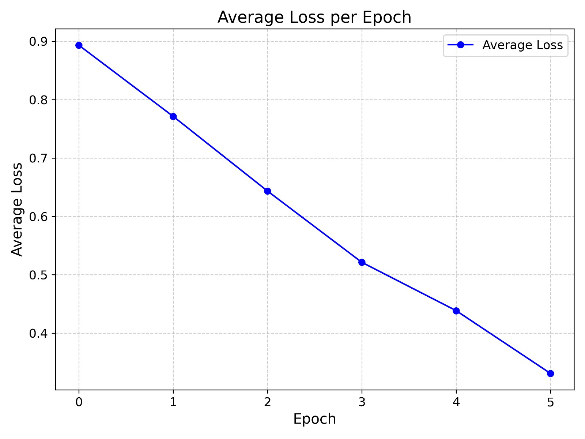
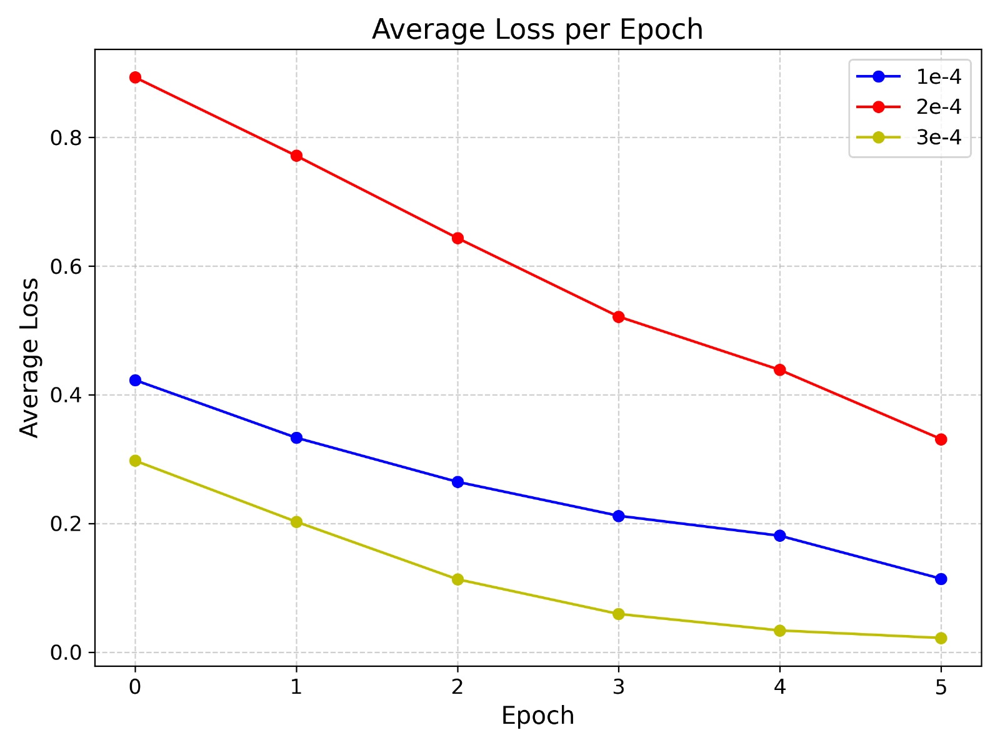
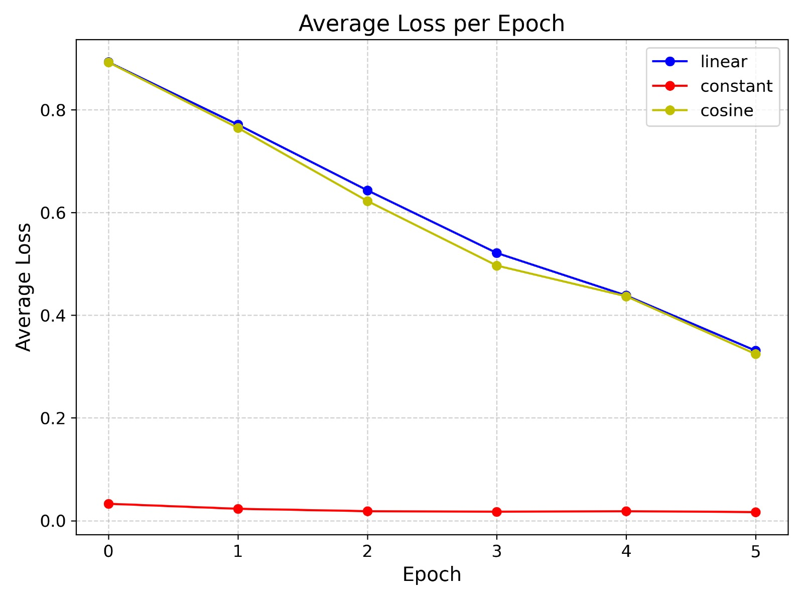
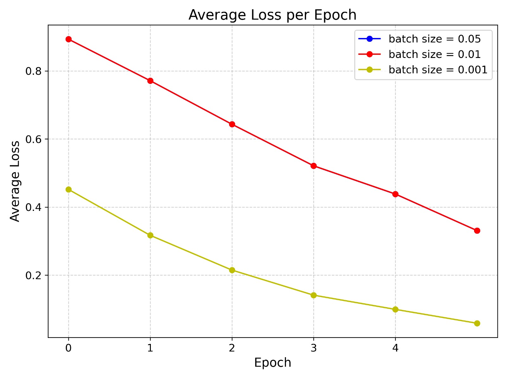

# ID2223 Lab 2 Report: Fine-Tuning and Deploying a Large Language Model for Cover Letter Generation

## Purpose of the Lab
The purpose of this lab is to fine-tune an existing pre-trained large language model (LLM) on the FineTome Instruction Dataset and build an inference pipeline with a Gradio UI on Hugging Face Spaces. The goal is to create a system that can generate personalized, professional cover letters based on user inputs, leveraging the power of LLMs to automate and enhance the job application process.

## General Process
1. **Data Preparation**: Prepare the FineTome Instruction Dataset for fine-tuning.
2. **Model Fine-Tuning**: Fine-tune the pre-trained LLM using the dataset.
3. **Model Export**: Export the fine-tuned model to the GGUF format for efficient inference.
4. **UI Development**: Develop a Gradio UI for user interaction and cover letter generation.
5. **Deployment**: Deploy the model and UI on Hugging Face Spaces.

## Task 1: Fine-Tuning the Model

### Fine-Tuning
We fine-tuned the LLM using the FineTome Instruction Dataset. To save checkpoints and train the model in several runs on one epoch, we modified the `TrainingArguments` as follows:

```python
output_dir = "outputs",
num_train_epochs = 1,
save_steps = 100, # Saves checkpoints every 100 steps
```

The complete training script looks like this:

```python
trainer = SFTTrainer(
    model=model,
    tokenizer=tokenizer,
    train_dataset=dataset,
    dataset_text_field="text",
    max_seq_length=max_seq_length,
    data_collator=DataCollatorForSeq2Seq(tokenizer=tokenizer),
    dataset_num_proc=2,
    packing=False,
    args=TrainingArguments(
        per_device_train_batch_size=2,
        gradient_accumulation_steps=4,
        warmup_steps=5,
        num_train_epochs=1,
        learning_rate=2e-4,
        fp16=not is_bfloat16_supported(),
        bf16=is_bfloat16_supported(),
        logging_steps=1,
        optim="adamw_8bit",
        weight_decay=0.01,
        lr_scheduler_type="linear",
        seed=3407,
        report_to="none",
        output_dir="outputs", # Saves checkpoints to /outputs folder
        save_strategy="steps", # Saves checkpoints by steps
        save_steps=100, # Saves checkpoints every 100 steps
    ),
)
```

To start the training, we used:

```python
trainer_stats = trainer.train()
```

To resume training from checkpoints, we used:

```python
trainer_stats = trainer.train(resume_from_checkpoint=True)
```

We zipped the checkpoints folder to download and save the state between sessions:

```bash
%cd outputs/
!zip -r checkpoint-1000.zip checkpoint-1000/
%cd ..
```

For the model training, we used `unsloth/Llama-3.2-1B-Instruct`:

The training process took approximately 10 hours for 1 epoch on Colab's TPU.

We also exported the model into the GGUF format:

```python
model.push_to_hub_gguf(
    "minifixio/lora_model_gguf", # Change hf to your username!
    tokenizer,
    quantization_method=["q4_k_m", "q8_0", "q5_k_m"],
    token=huggingface_api_key, # Get a token at https://huggingface.co/settings/tokens
)
```

And then load it using:

```python
from llama_cpp import Llama

# Load the pretrained LLM
llm = Llama.from_pretrained(
    repo_id="minifixio/lora_model_gguf",
    filename="*Q8_0.gguf",
    verbose=False,
    chat_format="llama-3",
)
```

That way, we could run the inference on Hugging Face's free CPU because otherwise, using unsloth inference required GPUs.

## Task 2: Improving Model Performance

### Model-Centric Approach
1. **Hyperparameter Tuning**:
   - **Learning Rate**: We set the learning rate to `2e-4` to ensure stable training.
   - **Batch Size**: We used a batch size of 2 to fit within the memory constraints of Colab's TPU.
   - **Gradient Accumulation Steps**: We set this to 4 to effectively increase the batch size and stabilize training.
   - **Warmup Steps**: We used 5 warmup steps to gradually increase the learning rate at the start of training.
   - **Weight Decay**: We set weight decay to `0.01` to prevent overfitting.
   - **Optimizer**: We used the `adamw_8bit` optimizer for efficient training with 8-bit precision.

2. **Model Architecture**:
   - We chose the `unsloth/Llama-3.2-1B-Instruct` model for its balance between size and performance. The 1B parameter model is small enough to fine-tune efficiently on Colab's TPU while still providing good performance.
   - We used 4-bit quantization to reduce the model size and memory footprint, making it feasible to run inference on CPUs.

   The performance of the fine-tuned model was evaluated on a smaller dataset (1k samples) over 5 epochs. Detailed hyperparameter tuning experiments and results can be found in the notebook `model_performance.ipynb` located in the `/notebook` folder.

- **3. Key Hyperparameters and Their Impact on Model Performance:**

1. **Number of Training Epochs**: Training loss consistently decreased with more epochs, indicating that the model effectively learned from the data with sufficient training opportunities. 
    
2. **Learning Rate**: Higher learning rates helped reduce training loss per epoch more effectively, likely by avoiding local minima. However, careful tuning was necessary to prevent unstable convergence. 
    
3. **Learning Rate Scheduler (`lr_scheduler_type`)**: Experiments compared linear, constant, and cosine schedulers. Results showed no significant improvement in model performance over the default scheduler. 
    
4. **Weight Decay**: This regularization technique penalized large weights to reduce overfitting. Among tested values (0.001, 0.01, and 0.05), `0.001` produced the best average loss. 
    

These insights were instrumental in refining the training process to achieve better results with limited computational resources.


### Data-Centric Approach

1. **Fine-Tuning on Cover Letter Dataset**:
   - We fine-tuned the model on the **ShashiVish/cover-letter-dataset** to improve its ability to generate personalized cover letters. This dataset contains real-world job application details and corresponding cover letters.
   - The data was processed by creating prompts with job-specific details (e.g., job title, qualifications) and tokenizing both the input and the output (cover letter).

   ```python
    from datasets import load_dataset

    dataset = load_dataset("ShashiVish/cover-letter-dataset", split="train")

    def format_cover_letter_with_labels(batch):
        inputs_list = []
        for i in range(len(batch['Job Title'])):
            job_title = batch['Job Title'][i]
            qualifications = batch['Preferred Qualifications'][i]
            company = batch['Hiring Company'][i]
            name = batch['Applicant Name'][i]
            past_experience = batch['Past Working Experience'][i]
            current_experience = batch['Current Working Experience'][i]
            skillsets = batch['Skillsets'][i]
            qualifications = batch['Qualifications'][i]
            cover_letter = batch['Cover Letter'][i]

            prompt = (
                f"Write a personalized cover letter.\n\n"
                f"Job Title: {job_title}\n"
                f"Preferred Qualifications: {qualifications}\n"
                f"Hiring Company: {company}\n"
                f"Applicant Name: {name}\n"
                f"Past Working Experience: {past_experience}\n"
                f"Current Working Experience: {current_experience}\n"
                f"Skillsets: {skillsets}\n"
                f"Qualifications: {qualifications}\n\n"
                f"Cover Letter:"
            )

            input_text = prompt
            output_text = cover_letter

            # Tokenize and create input-output pairs
            inputs = tokenizer(input_text, truncation=True, padding="max_length", max_length=max_seq_length)
            labels = tokenizer(output_text, truncation=True, padding="max_length", max_length=max_seq_length)

            inputs["labels"] = labels["input_ids"]
            inputs_list.append(inputs)

        # Combine all inputs into a single dictionary of lists
        return {key: [d[key] for d in inputs_list] for key in inputs_list[0].keys()}


    dataset = dataset.map(format_cover_letter_with_labels, batched=True)
   ```
Our attempt to fine-tune the model on the ShashiVish/cover-letter-dataset was not as successful as anticipated. Despite the goal of improving the model's ability to generate personalized cover letters, the process resulted in high training losses and suboptimal performance. Below, we analyze the challenges and potential reasons for these outcomes :

1. **Dataset Misalignment**:  
   The initial **FineTome** dataset had a structured, instructional style, while the new dataset focused on personalized, narrative-style text, causing adaptation difficulties.

2. **Data Variability**:  
   Inconsistencies in data presentation (e.g., qualifications and experiences) hindered model generalization.

3. **Overfitting Risks**:  
   Fine-tuning on a small, specialized dataset after prior training likely caused overfitting to specific patterns.


### Model Export: GGUF Format
The GGUF (General Graph Unified Format) is a highly efficient format for storing and deploying machine learning models. It supports various quantization methods, including 4-bit, 8-bit, and 16-bit, which significantly reduce the model size and memory footprint. This makes it ideal for running inference on CPUs, which is crucial for deploying the model on Hugging Face's free tier.

By exporting the model to the GGUF format, we ensure that it can be easily deployed and run efficiently on CPUs, making it accessible to a wider audience without the need for expensive GPU resources.

### UI Development

#### Background
The idea for this UI emerged from a personal problem when applying for many jobs. Having to write a specific cover letter from scratch for each application was time-consuming and tedious. To address this, we came up with the idea of using a large language model (LLM) to automate the generation of professional cover letters.

#### UI Implementation
We developed a Gradio UI that allows users to input their personal and job application details to generate a personalized, professional cover letter using a pre-trained LLM.

The UI is implemented in the `huggingface/app.py` file. The code integrates a pre-trained Llama model using `Llama.from_pretrained()` for chat-based completion. It dynamically constructs a prompt in the `generate_cover_letter` function by incorporating user inputs such as `name`, `job_title`, `company_name`, `skills`, and `reasons`. The system removes repetitive prefixes from the LLM response for cleaner output. The Gradio UI provides text input fields for these details, along with a button to trigger letter generation, dynamically displaying the output in a text box. A customizable system message guides the LLM's behavior in generating professional cover letters.

You can use it [here](https://huggingface.co/spaces/minifixio/ID2223-lab2).
